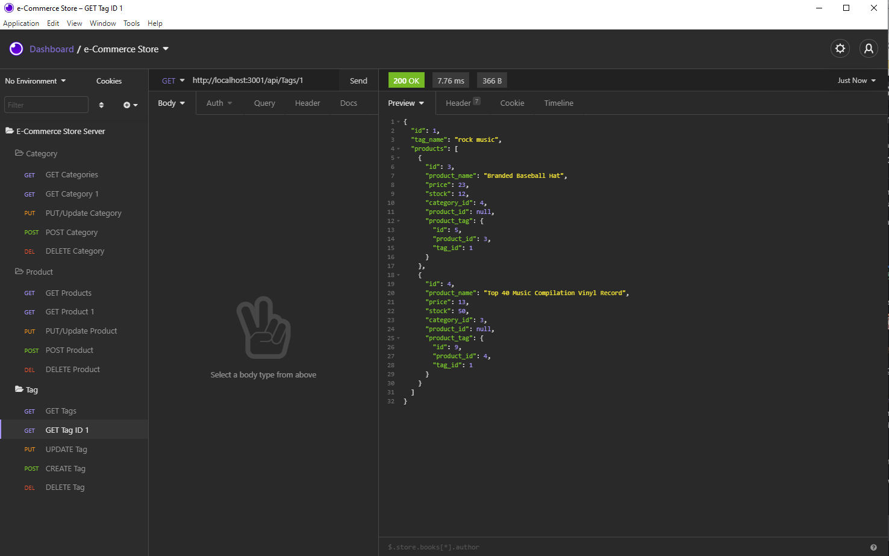
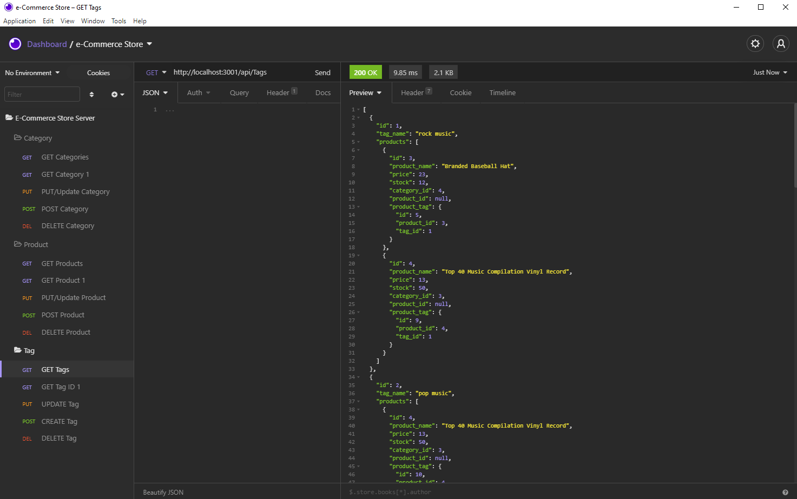
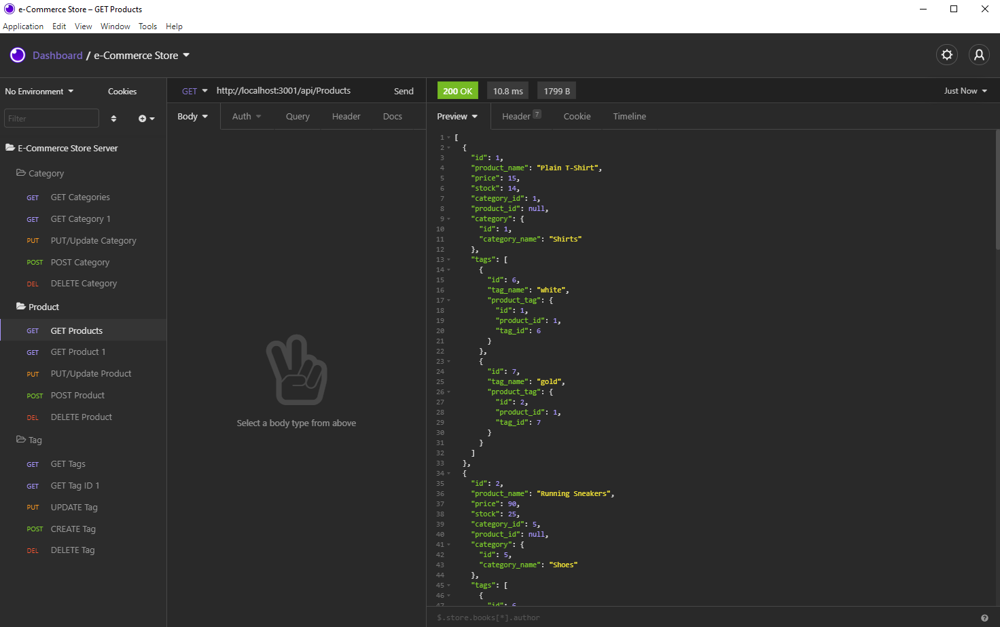
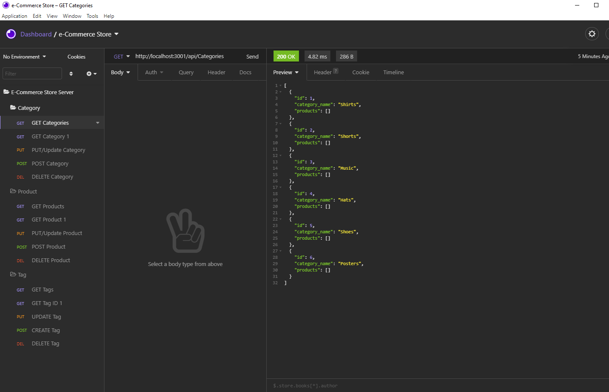

# E-Commerce Store Backend

## Table of Contents

* [License](#license)
* [Links](#links)
* [Description](#description)
* [Installation Instructions](#installation-instructions)
* [User Story](#user-story)
* [Technology Used](#technology-used)
* [Tests](#tests)
* [Questions](#questions)
* [Credits](#credits)

## License
 
* [](https://opensource.org/licenses/MIT)
  
## Links
 
* [Github Repository](https://github.com/emacartoon/Tech-Blog) 
* [Video Walkthrough](https://drive.google.com/file/d/1-W7ZWs2AwKuiR6kDbKM8pqZtO3hTsmg5/view) 
 
## Description

This particular homework assignment was for us to create a backend e-commerce site to manage inventory, categories, and products. The idea is to familiarize us with backend JavaScript, mySQL, and Node development.


## Installation Instructions
 
After you clone down the repo, you will need to install the npm packages in your environment. This should be easily achieved with:
```
npm i sequelize mysql2 dotenv
```
 
To run the api, use Node to run the server script:
```
node server.js
```


## User Story

```md
AS A manager at an internet retail company
I WANT a back end for my e-commerce website that uses the latest technologies
SO THAT my company can compete with other e-commerce companies
```
 ```md
GIVEN a functional Express.js API
WHEN I add my database name, MySQL username, and MySQL password to an environment variable file
THEN I am able to connect to a database using Sequelize
WHEN I enter schema and seed commands
THEN a development database is created and is seeded with test data
WHEN I enter the command to invoke the application
THEN my server is started and the Sequelize models are synced to the MySQL database
WHEN I open API GET routes in Insomnia Core for categories, products, or tags
THEN the data for each of these routes is displayed in a formatted JSON
WHEN I test API POST, PUT, and DELETE routes in Insomnia Core
THEN I am able to successfully create, update, and delete data in my database 
```

  
## Technology Used
 
- JavaScript
- Node.js 
- [Sequelize](https://www.npmjs.com/package/sequelize) 
- [MySQL2](https://www.npmjs.com/package/mysql2)
- [dotenv package](https://www.npmjs.com/package/dotenv)
  

## Tests
Run
```
npm run seed
```
to seed the database with generated data to test the functionality of the routes. Testing performed in Insomnia Core.

### Insomnia Screenshots

GET Tag

GET Tags

GET Products

GET Categories


## Questions
 
If you have any questions about this project, or happen to use this project, please reach out to me!
<br>
Email: emacartoon@gmail.com
<br>
GitHub: [@EmaCartoon](https://github.com/EmaCartoon)

 
## Credits
Trilogy curriculum, my instructor and TAs - Tucker, Clark, and Nick. As well as Dan Lucas and Matthew Johnson for asking questions on things I also had issues on which led to the completion of this project, and Kyle Grabinski for helping me figure out why my updates weren't working.
